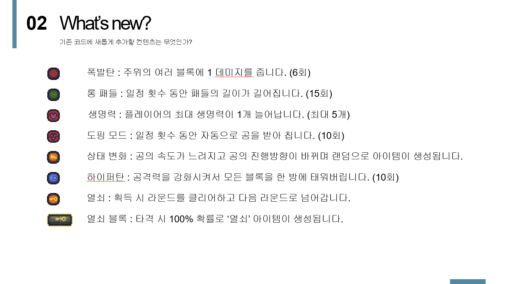

# 자바스크립트를 이용한 벽돌깨기 게임 제작

## 준비사항
- html5
- javascript
- Chrome

## 게임 아이템 안내

## 협업툴
 - slack(https://app.slack.com/client/TNZ5B3MFZ/CNKQR8E7M)

## GameTheme(게임 테마)
- 광란의 금요일 밤의 도시에서 벌어지는 블록 파티!
- 금요일 자정을 넘어 토요일 아침 해가 떠오르기전까지 미친듯이 놀아라!
- 비가 와도 문제 없어! 비가 오면 실내에서 파티를 즐기면 돼!
- 비가 그치면 밖으로 나가서 파티를 계속 해보자고!!
- 토요일 일출이면 블록 파티는 종료!
- 과연 누가 해뜨기 전까지 블록 파티에서 최고 점수를 획득할 수 있을까?

## 패치내역
- 점수
    - 10 콤보 당 블럭 파괴 시 점수 1점 보너스 획득
    - 공 속도에 따라 점수 보너스가 배율로 적용
    - 라운드 클리어 시 받는 보너스 스코어 상승
    - 게임 오버 시에도 엔딩 페이지로 이동하며 점수 확인 가능
    - 점수가 중첩되어 오르던 부분 수정
- 사운드
    - 's'를 눌러 배경음악을 on / off 할 수 있음
    - 게임 메인의 배경 음악 추가
    - 게임 엔딩의 배경 음악 추가
- 게임 시간 추가
    - 게임 플레이 시간이 좌측 하단에 나옴
- 랭킹 시스템 도입
    - 로컬 저장소를 이용하여 랭킹 점수 관리 가능

## 코드 업데이트 일지
- 소스 분석
    - [X] 변수 분석
    - [X] 함수 분석
    - [X] 작동 원리 이해
    - [X] ppt 제작
        - [X] 코드분석
        - [X] 계획안
- 기능 추가하기
    - [X] 패들이 끝이 화면 바깥으로 나가려고하면 더 이상 못가도록 수정
    - [X] 공, 패들, 벽돌, 배경 이미지 수정
    - [X] 게임 내 배경음악 추가
    - [X] 공의 충돌 여부에 따른 입자 생성
    - [X] 난이도 별 스테이지 추가
    - [X] 2회 이상 타격해야 부숴지는 벽돌 추가
    - [X] 일정확률로 벽돌 타격 시 아이템이 소환되는 기능 추가
        - [X] 일정 횟수 동안 타격시 주변 블럭도 파괴시키는 아이템
        - [X] 단단한 블럭을 타격 즉시 파괴시키는 아이템
        - [X] 플레이어 목숨 증가시키는 아이템
        - [X] 상태 변화 아이템
            - [X] 공 속도 감속
            - [X] 공의 진행 방향 반전
            - [X] 랜덤확률로 공의 위치에 아이템 소환
        - [X] 패들의 길이를 확대 시켜주는 아이템
        - [X] 인공지능으로 공을 받아 쳐주는 아이템
        - [X] 라운드를 바로 클리어 시켜주는 열쇠 아이템
    - [X] 패들과 공이 닿는 위치에 따라 다른 각도와 속도로 공이 튕겨 나가게 하기
    - [X] 시간의 흐름에 따라 공의 속도가 점점 빨라짐 추가
    - [X] 게임 클리어 시 게임에서 획득한 점수 표시 및 재시작 버튼 알림
    - [X] 오토모드를 구현하여 자동 플레이기능 추가
    - [X] 벽에 충돌 시 절대 값으로 튕겨나가는 것이 아닌 약간 중력의 영향으로 꺾이는 느낌으로 구현
    - [X] 열쇠블럭을 추가하여 열쇠블럭을 타격 시 다음스테이지로 이동하게끔 구현하기
    - [X] 특수키
        - 'A' : 게임을 자동으로 진행합니다.
        - 'R' : 게임을 리로드 합니다.
        - 'T' : 입력 시 공의 속도가 20% 빨라집니다.
        - 'N' : 즉시 다음 라운드로 이동합니다.
- 리소스 추가하기
    - [X] 이미지 추가하기
        - [X] 공
        - [X] 패들
        - [X] 벽돌
        - [X] 아이템
        - [X] 배경
        - [X] 파티클
            - [X] 벽돌 파괴
            - [X] 메뉴 등을 선택할 때
            - [X] 플레이 버튼 위에 커서 둘 때
    - [X] 소리 추가하기
        - [X] BGM
        - [X] 타격음
        - [X] GAME OVER
        - [X] 아이템 획득 시
- Version 1.0
    - [X] 틀 가져오기
    - [X] 완성
- 출처
    - 패들, 벽돌 이미지
        - https://opengameart.org/content/breakout-set
    - 공
        - 포켓볼
            - http://pngimg.com/imgs/fantasy/pokeball/
    - 이미지 관련 코드 구현법
        - https://combatguri.tistory.com/entry/22-Slicing-%EC%9D%B4%EB%AF%B8%EC%A7%80-%EC%9E%90%EB%A5%B4%EA%B8%B0%ED%81%AC%EB%A1%AD
    - block party 이미지
        - https://kirokazepixel.tumblr.com/post/179351177975/background-commissioned-for-the-puzzle-game-block
    - 각종 gif 출처
        - https://www.tumblr.com/search/pixel+background+gif
    - 배경음악
        - https://bgmstore.net/view/5bb0d13f352039d2270a759e/[%EC%9E%90%EC%9E%91%EA%B3%A1]%20%EC%9D%8C%EC%9C%A0%20-%20Sakuria%20(%EB%B9%84%ED%8A%B8,%20%EB%8D%A5%EC%8A%A4%ED%85%9D,%20%EC%9D%BC%EB%A0%89,%20%EC%8B%A0%EB%82%A8,%20%ED%9D%A5%EA%B2%A8%EC%9B%80,%20%EB%B9%84%EC%9E%A5,%20%ED%81%B4%EB%9F%BD)
    - 효과음
        - minecraft
